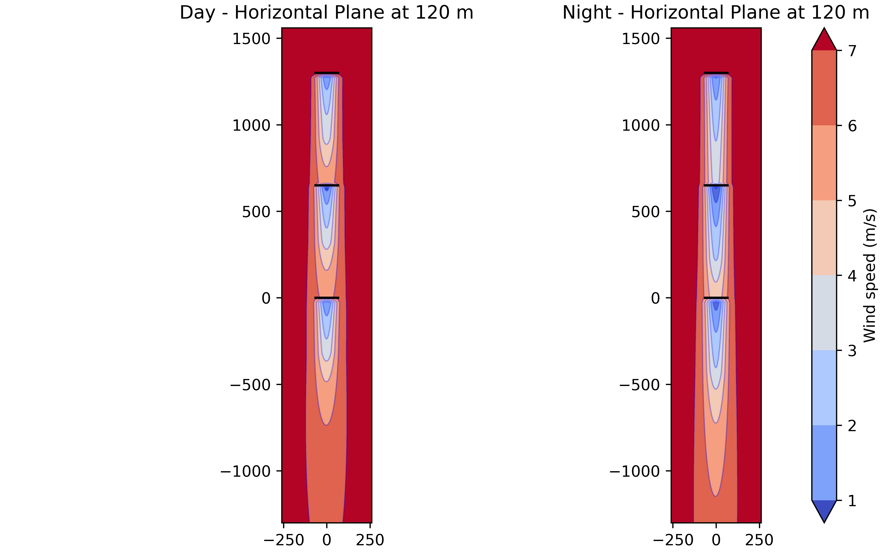
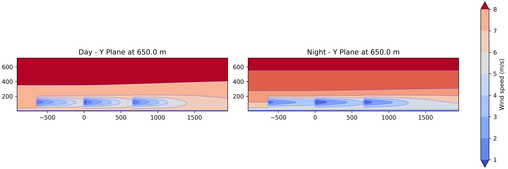
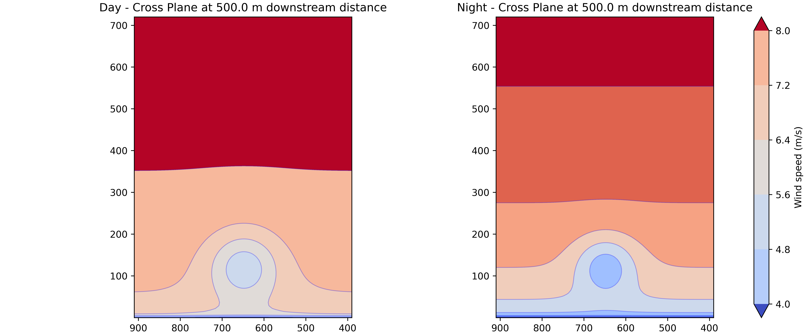

## Assignment3

### Task 1
Added IEA 3.4 MW file to turbine library called: IEA3_4_MW.yaml
Procedure: Copied IEA 10MW file, used available info from assignment sheet and csv file. Did not change info that wasnt directly given such as: controller_dependent_turbine_parameters or some scalars like cosine_loss_exponent_tilt in the power table. Added extra variable in .yaml file for cp (power coefficient) readings from csv file, as this is requested in task 2.

### Task 2
Ct, Cp, Power and power vs. yaw for 1,150 and 1,225 air densities and 7,5 m/s wind speed for -30° to +30° yaw angles.

Resulting graphs:

There seem to be no differences of both thrust or power coefficients regarding changes in the air density.

The power curve for IEA 3.4 MW. On the right side the power curves for different air densities for various yaw angles. Especially for the different yaw angles a reduction in air density leads to a very visible reduction in produced power.

### Task 3
Define the wind farm in FLORIS and visualize the wind farm flow field in the (a) horizontal 
plane at hub height, (b) stream-wise plane, and (c) span-wise plane when the wind speed 
is 7.5 m/s for two wind directions of 0° and 240°.

#### Resulting graphs for 0° and 7.5 m/s:

#### Resulting graphs for 240° and 7.5 m/s:

### Task 4
Note: I changed 2 values to 0.075 from 0.05, as I was unsure which the correct kw value is in the jensen.yaml. The 2 values were:
- jimenez wake_deflection_parameters: kd
- jensen wake_velocity_parameters: we

You should receive a terminal output reading: 
- Wind direction: 0°:
- Turbine Powers (KW): [ 807.29781772  866.56161592 1505.91490815]
- Farm Power (KW): 3179.774341782955
- Wind direction: 240°:
- Turbine Powers (KW): [1505.91490815 1505.91490815 1505.91490815]
- Farm Power (KW): 4517.744724440998

#### Comparison with hand calculated values from assignment 2 for 0°:
- Hand calculated turbine outputs (KW): [ 812.42  872.36 1515.15]
- Simulated turbine outputs (KW): [ 807.2978  866.5616 1505.9149]
- Difference in turbine outputs in %: [0.63 0.66 0.61]
- Hand-calculated Farm Power (KW): 3199.93
- Simulated Farm Power (KW): 3179.77
- Difference in Farm Power (KW): 20.16
- Difference farm power in %: -0.63 for floris simulated case.

#### Likely reasons for differences in final values:
- Larger rounding errors in hand calculation
- Simplifications in hand calculation. It seems to me that the pre-built jensen model in floris calculates the solutions with defelection and turbulence parameters which I did not take into account by hand.

### Task 5
Reused same calculation as for task 4, except changing layout_y coordinates to 10D distances. The drop in power for secondary and third turbine is significantly less.

Wind direction: 0° with 10D separation:
- Turbine Powers (KW): [1140.48525628 1163.23271043 1505.91490815]
- Farm Power (KW): 3809.632874855524

Relative difference in farm power between 5D and 10D cases: +19.81% in 10D case.

### Task 6
Gaussian wake model for different wind shear and turbulence intensities for day and night.

In the day and night comparison for the horizontal plane we can clearly recognize, that the wind speeds are more reduced for the second turbine then for the third turbine. The wind seems to have recovered more for the third turbine. 

The Y Plane visualisation shows the different atmospheric layering during day and night. At night reduced wind speeds stack up much higher then during the day due to less mixing of the layers. We can also see the more reduced wind speeds for the second turbine compared to the thrid turbine.

The cross plane shows the mentioned effect of different layering during day and night as well. It also shows how the wind speed has recovered much better during the day then during the night. Note that this cross section is between T1 and T2 at 500 m downstream distance.

Results indicate a counterintuitive situation in which the second turbine generates less energy then the third turbine. \
Day conditions:
- Turbine powers (KW): [[ 760.60998091  725.01817779 1509.48742723]]
- Farm power (KW): [2995.11558594]

Night conditions:
- Turbine powers (KW): [[ 464.75315535  396.56554767 1506.6874367 ]]
- Farm power (KW): [2368.00613971]

#### Interpretation and Analysis of Wind Farm Performance
The simulation shows how different atmospheric conditions change the power output of a wind farm. Counterintuituve, the third turbine in the row (T3) produces more power than the middle turbine (T2) in both cases. This result seemed wronged at first, but it is a known effect in wake theory. It shows that the wind farm is actually recovering some of its energy as the air flows downstream. The main reason for the power increase at the third turbine is "wake-added turbulence". The first turbine (T1) faces clean, smooth air. As the wind passes through T1 and T2, these turbines stir up the air like a giant blender. This extra turbulence helps mix the slow air inside the wake with the fast air outside of it. Because the air is more "mixed" by the time it reaches T3, the wind speed has recovered more than it did for T2. This explains why T3 produces roughly $35 \text{ kW}$ to $68 \text{ kW}$ more than T2 in our tests. The atmosphere changes significantly between day and night, which impacts the farm efficiency. Day Conditions: The air has higher natural turbulence ($12\%$) and lower wind shear ($0.06$). The total farm power is higher ($2995 \text{ kW}$) because the natural mixing helps the wakes disappear faster.Night Conditions: The air is much more stable with low natural turbulence ($6\%$) and high shear ($0.22$). The wakes become "stuck" and last much longer. At night, the first wake is very deep, which causes T2 to lose more than $70\%$ of its potential power compared to T1. However, the mixing effect from the turbines is even more important at night because there is no natural turbulence to help. These results prove that the Gaussian Model used here is more realistic than the Jensen Model from the previous assignments and tasks. The Jensen model only shows wind speed dropping further as you go downstream. The Gaussian model correctly captures the physics of air mixing and momentum recovery. This allows us to see how T3 can actually perform better than the turbine directly in front of it.