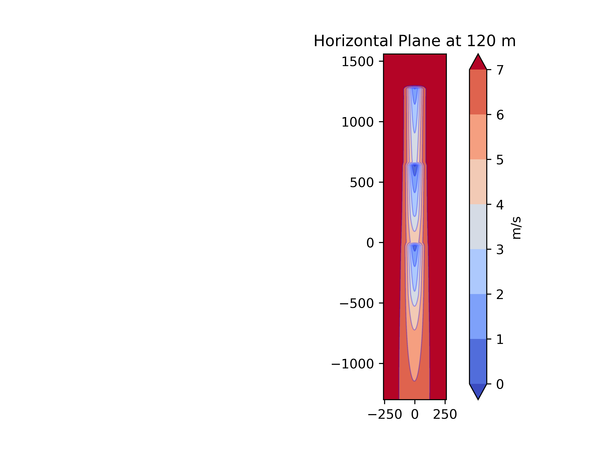
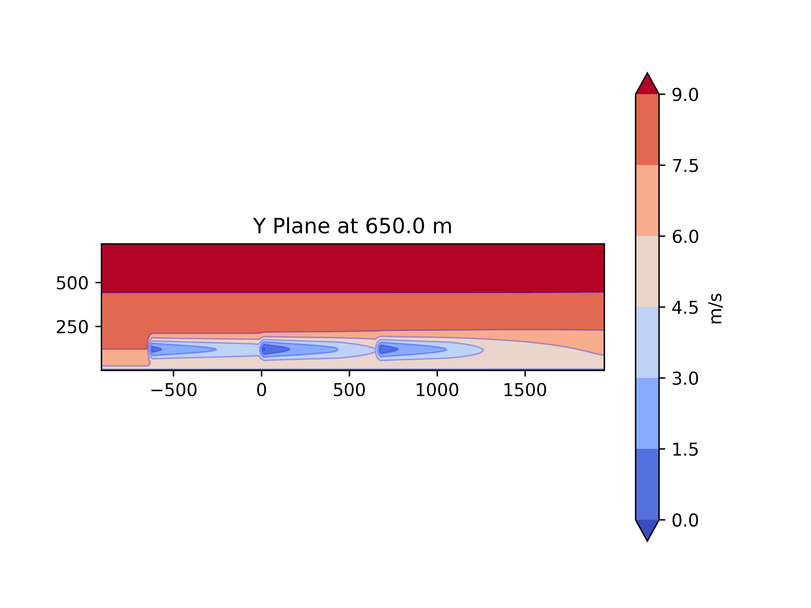
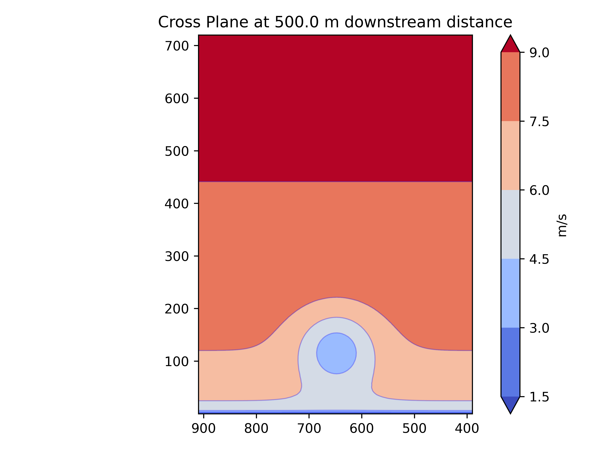
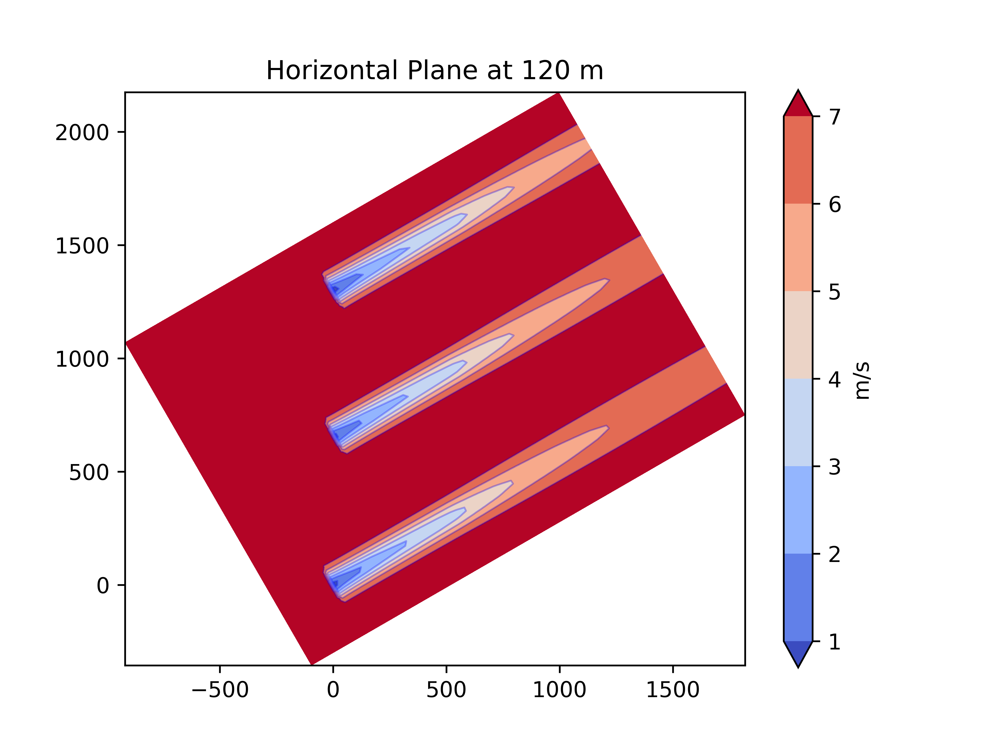
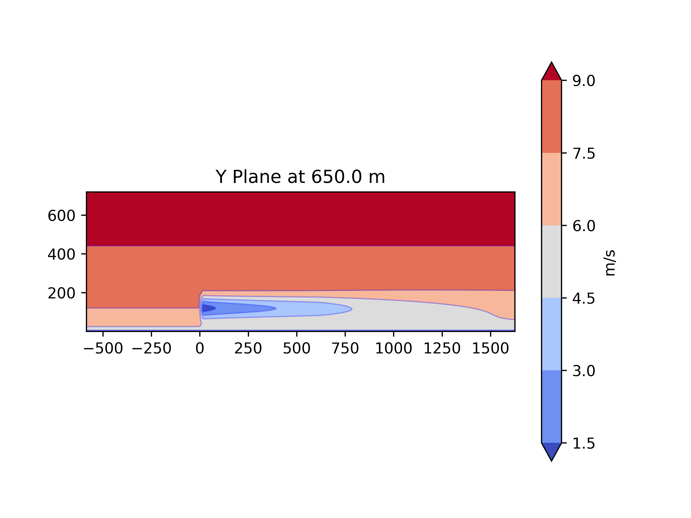
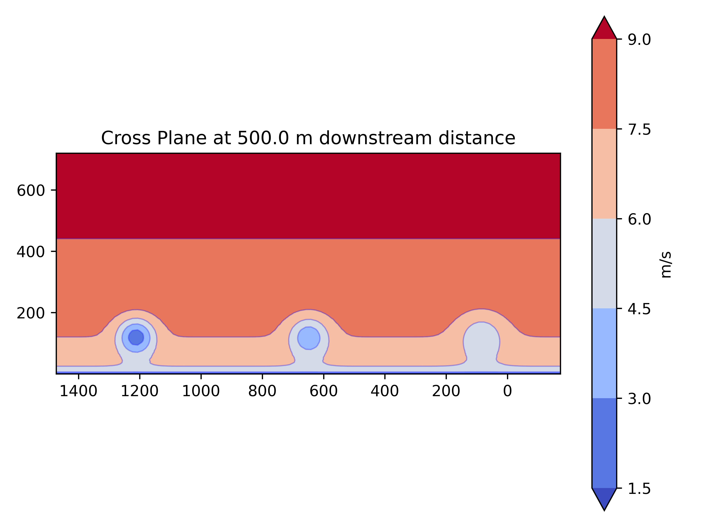

## Assignment3

### Task 1
Added IEA 3.4 MW file to turbine library called: IEA3_4_MW.yaml
Procedure: Copied IEA 10MW file, used available info from assignment sheet and csv file. Did not change info that wasnt directly given such as: controller_dependent_turbine_parameters or some scalars like cosine_loss_exponent_tilt in the power table. Added extra variable in .yaml file for cp (power coefficient) readings from csv file, as this is requested in task 2.

### Task 2
Ct, Cp, Power and power vs. yaw for 1,150 and 1,225 air densities and 7,5 m/s wind speed for -30° to +30° yaw angles.

Resulting graphs:

There seem to be no differences of both thrust or power coefficients regarding changes in the air density.

The power curve for IEA 3.4 MW. On the right side the power curves for different air densities for various yaw angles. 

### Task 3
Define the wind farm in FLORIS and visualize the wind farm flow field in the (a) horizontal 
plane at hub height, (b) stream-wise plane, and (c) span-wise plane when the wind speed 
is 7.5 m/s for two wind directions of 0° and 240°.

Resulting graphs for 0° and 7.5 m/s:

Resulting graphs for 240° and 7.5 m/s:

### Task 4
Note: I changed 2 values to 0.075 from 0.05, as I was unsure which the correct kw value is in the jensen.yaml. The 2 values were:
- jimenez wake_deflection_parameters: kd
- jensen wake_velocity_parameters: we

You should receive a terminal output reading: \
- Wind direction: 0°:
- Turbine Powers (KW): [ 807.29781772  866.56161592 1505.91490815]
- Farm Power (KW): 3179.774341782955
- Wind direction: 240°:
- Turbine Powers (KW): [1505.91490815 1505.91490815 1505.91490815]
- Farm Power (KW): 4517.744724440998

#### Comparison with hand calculated values from assignment 2 for 0°:
- Hand calculated turbine outputs (KW): [ 812.42  872.36 1515.15]
- Simulated turbine outputs (KW): [ 807.2978  866.5616 1505.9149]
- Difference in turbine outputs in %: [0.63 0.66 0.61]
- Hand-calculated Farm Power (KW): 3199.93
- Simulated Farm Power (KW): 3179.77
- Difference in Farm Power (KW): 20.16
- Difference farm power in %: 0.63

#### Likely reasons for differences in final values:
- Larger rounding errors in hand calculation
- Simplifications in hand calculation. It seems to me that the pre-built jensen model in floris calculates the solutions with defelection and turbulence parameters which I did not take into account by hand.