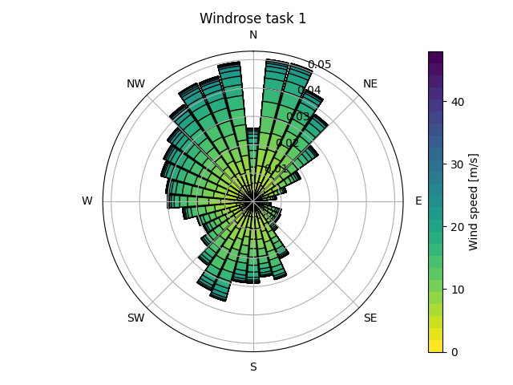

## Asignment 4
Working with Floris and Landbosse.

### Task 1
 \
5° discretizations steps for wind direction.

### Task 2
For task 2 I defined a second windrose object with a 1° discretizatino step for the wind directions and changed all requested parameters in the project_list.xlsx. One value I calculated by hand was the rated thrust.

$$T = 0.5 \cdot \rho \cdot A \cdot V^2 \cdot C_t$$
$$T = 0.5 \cdot 1.225 kg/m³ \cdot 13,273.23 m² \cdot 96.04 m²/s² \cdot 0.8068$$

Result: The rated thrust is approximately $630\text{ kN}$.

I choose a cable setup with a single cable running from the substation to the middle turbine and then a cable each to the northern and southern turbine.

AEP: 57012.82 kWh \
AEP no wake: 57814.68 kWh \
Cp wind farm: 0.6437 \
Efficiency: 0.9861 % 

### Task 3

When executing landbosse with the given data I received:
- project_id: foundation_validation_iea36_120
- project data: input\project_data\iea36_120_project_data.xlsx
- Annual AEP: 57,012,816 kWh
- Total BOP Cost: $8,540,274
- Total Investment (CapEx): $21,683,274
- Total Annual O&M (OpEx): $1,114,405

LCOE: $0.0475 / kWh

### Task 4
LCOE Comparison:
- My Calculated LCOE:    $0.0475 / kWh
- IRENA (2023 Avg):        $0.0330 / kWh
- Lazard (2024) Range:      $0.027 - $0.075 / kWh

IRENA stands for International Renewable Energy Agency. The cited value is an industry average and stems from their published report in 2023: https://www.irena.org/Publications/2024/Sep/Renewable-Power-Generation-Costs-in-2023 , last accessed on 12.05.2026.

Lazard is a firm active in asset management and financial advisory. They issued a report about renewable energy in 2024 defining a typical range of LCOE: https://www.lazard.com/media/xemfey0k/lazards-lcoeplus-june-2024-_vf.pdf , last accessed on 12.05.2026.

Pie chart breakdown of types of costs when building a wind farm.

### Task 5

I re-ran floris and landbosse for 8D spacing. Because of OOP code architecture I could reuse the functions task2 and task3. With introducing a verbosity param I could silence their terminal prints for recalculations.

- AEP 5D: 57.0128 GWh | AEP 8D: 57.4287 GWh
- Relative AEP Change: +0.73%
- LCOE 5D: $0.0475/kWh | LCOE 8D: $0.0474/kWh
- Relative LCOE Change: -0.34%
- Observation: Increasing spacing reduced wake losses, increasing AEP.
- Observation: AEP gains from reduced wakes outweighed higher cabling costs, decreasing LCOE.

### Task 6
A dropping discount rate means  future revenues are discounted less heavily, while intial costs are not affected, therefore reducing the LCOE.

- Original Discount Rate: 4.0%
- New Discount Rate:      3.6%
- LCOE (Baseline):        $0.0475/kWh
- LCOE (New Rate):        $0.0465/kWh
- Relative LCOE Change:   -2.07%

### Task 7
This simulation is built around a small farm of only 3 turbines. In reality wind farms are often much larger (often 10+ turbines) and distribute the upfront Balance of Plant (BoP) costs—such as the substation, primary grid connection, and access roads—across a much larger energy output, significantly driving down the LCOE. Other reasons not accounted for are fluctuating energy prices and government subsidies.

### Task 8
For task 8 it is necessary to calculate the cash flows for each year. 
- Electricity price (averaged): $0.0418/kWh (41.8 $/MWh)
- Initial investment: $21,683,274.29
- Annual revenue: $2,383,135.72
- Annual O&M: $1,114,405.06
- Annual net cash flow: $1,268,730.66
- IRR (numerical): 1.55%
- PI (at 4.0% discount rate): 0.7952

Economic assessment: Project is not attractive (PI < 1).

### Task 9
Calculations for increasing turbines in strict north to south direction. Note that the BoP costs rise sharply from n=4 to n=5 causing a drop in PI.

- N= 1 | LCOE=$0.0572/kWh | PI=0.5913 | Annual Net CF=$429,806.29 | AEP=19.27 GWh | Investment=9878041$ | Revenue=805551$ | BoP=5497041$ | Turbine Capex=4381000$
- N= 2 | LCOE=$0.0500/kWh | PI=0.7304 | Annual Net CF=$849,796.90 | AEP=38.16 GWh | Investment=15812954$ | Revenue=1595200$ | BoP=7050954$ | Turbine Capex=8762000$
- N= 3 | LCOE=$0.0475/kWh | PI=0.7952 | Annual Net CF=$1,268,730.66 | AEP=57.01 GWh | Investment=21683274$ | Revenue=2383136$ | BoP=8540274$ | Turbine Capex=13143000$
- N= 4 | LCOE=$0.0462/kWh | PI=0.8342 | Annual Net CF=$1,687,451.48 | AEP=75.85 GWh | Investment=27492315$ | Revenue=3170727$ | BoP=9968315$ | Turbine Capex=17524000$
- N= 5 | LCOE=$0.2208/kWh | PI=0.1105 | Annual Net CF=$2,106,312.17 | AEP=94.70 GWh | Investment=258997091$ | Revenue=3958545$ | BoP=237092091$ | Turbine Capex=21905000$
- N= 6 | LCOE=$0.1906/kWh | PI=0.1300 | Annual Net CF=$2,525,101.99 | AEP=113.55 GWh | Investment=263978728$ | Revenue=4746247$ | BoP=237692728$ | Turbine Capex=26286000$
- N= 7 | LCOE=$0.1690/kWh | PI=0.1488 | Annual Net CF=$2,943,923.89 | AEP=132.39 GWh | Investment=268963328$ | Revenue=5534002$ | BoP=238296328$ | Turbine Capex=30667000$
- N= 8 | LCOE=$0.1528/kWh | PI=0.1668 | Annual Net CF=$3,362,663.08 | AEP=151.24 GWh | Investment=273943802$ | Revenue=6321623$ | BoP=238895802$ | Turbine Capex=35048000$
- N= 9 | LCOE=$0.1404/kWh | PI=0.1840 | Annual Net CF=$3,781,508.52 | AEP=170.08 GWh | Investment=279359058$ | Revenue=7109416$ | BoP=239930058$ | Turbine Capex=39429000$
- N=10 | LCOE=$0.1303/kWh | PI=0.2008 | Annual Net CF=$4,200,325.88 | AEP=188.93 GWh | Investment=284331895$ | Revenue=7897164$ | BoP=240521895$ | Turbine Capex=43810000$
- N=11 | LCOE=$0.1235/kWh | PI=0.2139 | Annual Net CF=$4,619,200.47 | AEP=207.78 GWh | Investment=293471303$ | Revenue=8685004$ | BoP=245280303$ | Turbine Capex=48191000$
- N=12 | LCOE=$0.1165/kWh | PI=0.2294 | Annual Net CF=$5,038,035.80 | AEP=226.62 GWh | Investment=298483435$ | Revenue=9472780$ | BoP=245911435$ | Turbine Capex=52572000$
- N=13 | LCOE=$0.1106/kWh | PI=0.2443 | Annual Net CF=$5,456,917.83 | AEP=245.47 GWh | Investment=303564294$ | Revenue=10260633$ | BoP=246611294$ | Turbine Capex=56953000$
- N=14 | LCOE=$0.1055/kWh | PI=0.2588 | Annual Net CF=$5,875,765.11 | AEP=264.32 GWh | Investment=308593520$ | Revenue=11048429$ | BoP=247259520$ | Turbine Capex=61334000$
- N=15 | LCOE=$0.1011/kWh | PI=0.2727 | Annual Net CF=$6,294,655.15 | AEP=283.16 GWh | Investment=313683212$ | Revenue=11836294$ | BoP=247968212$ | Turbine Capex=65715000$
- N=16 | LCOE=$0.0972/kWh | PI=0.2863 | Annual Net CF=$6,713,515.14 | AEP=302.01 GWh | Investment=318669011$ | Revenue=12624111$ | BoP=248573011$ | Turbine Capex=70096000$
- N=17 | LCOE=$0.0938/kWh | PI=0.2994 | Annual Net CF=$7,132,403.87 | AEP=320.86 GWh | Investment=323744940$ | Revenue=13411974$ | BoP=249267940$ | Turbine Capex=74477000$
- N=18 | LCOE=$0.0908/kWh | PI=0.3121 | Annual Net CF=$7,551,278.19 | AEP=339.71 GWh | Investment=328798290$ | Revenue=14199814$ | BoP=249940290$ | Turbine Capex=78858000$
- N=19 | LCOE=$0.0881/kWh | PI=0.3244 | Annual Net CF=$7,970,171.88 | AEP=358.56 GWh | Investment=333860949$ | Revenue=14987685$ | BoP=250621949$ | Turbine Capex=83239000$
- N=20 | LCOE=$0.0856/kWh | PI=0.3364 | Annual Net CF=$8,389,047.75 | AEP=377.40 GWh | Investment=338901155$ | Revenue=15775527$ | BoP=251281155$ | Turbine Capex=87620000$
- N=21 | LCOE=$0.0834/kWh | PI=0.3480 | Annual Net CF=$8,807,945.64 | AEP=396.25 GWh | Investment=343990517$ | Revenue=16563405$ | BoP=251989517$ | Turbine Capex=92001000$
- N=22 | LCOE=$0.0814/kWh | PI=0.3593 | Annual Net CF=$9,226,829.15 | AEP=415.10 GWh | Investment=349015684$ | Revenue=17351260$ | BoP=252633684$ | Turbine Capex=96382000$
- N=23 | LCOE=$0.0796/kWh | PI=0.3701 | Annual Net CF=$9,645,730.47 | AEP=433.95 GWh | Investment=354157625$ | Revenue=18139143$ | BoP=253394625$ | Turbine Capex=100763000$
- N=24 | LCOE=$0.0779/kWh | PI=0.3808 | Annual Net CF=$10,064,609.32 | AEP=452.80 GWh | Investment=359186867$ | Revenue=18926990$ | BoP=254042867$ | Turbine Capex=105144000$
- N=25 | LCOE=$0.0764/kWh | PI=0.3911 | Annual Net CF=$10,483,521.34 | AEP=471.65 GWh | Investment=364301949$ | Revenue=19714891$ | BoP=254776949$ | Turbine Capex=109525000$
- N=26 | LCOE=$0.0750/kWh | PI=0.4012 | Annual Net CF=$10,902,402.01 | AEP=490.50 GWh | Investment=369336640$ | Revenue=20502741$ | BoP=255430640$ | Turbine Capex=113906000$
- N=27 | LCOE=$0.0737/kWh | PI=0.4109 | Annual Net CF=$11,321,309.90 | AEP=509.35 GWh | Investment=374484216$ | Revenue=21290635$ | BoP=256197216$ | Turbine Capex=118287000$
- N=28 | LCOE=$0.0724/kWh | PI=0.4204 | Annual Net CF=$11,740,194.79 | AEP=528.19 GWh | Investment=379531449$ | Revenue=22078492$ | BoP=256863449$ | Turbine Capex=122668000$
- N=29 | LCOE=$0.0713/kWh | PI=0.4296 | Annual Net CF=$12,159,110.60 | AEP=547.04 GWh | Investment=384665103$ | Revenue=22866399$ | BoP=257616103$ | Turbine Capex=127049000$
- N=30 | LCOE=$0.0703/kWh | PI=0.4381 | Annual Net CF=$12,577,997.60 | AEP=565.89 GWh | Investment=390204508$ | Revenue=23654260$ | BoP=258774508$ | Turbine Capex=131430000$
- N=31 | LCOE=$0.0693/kWh | PI=0.4468 | Annual Net CF=$12,996,908.78 | AEP=584.74 GWh | Investment=395367655$ | Revenue=24442159$ | BoP=259556655$ | Turbine Capex=135811000$
- N=32 | LCOE=$0.0684/kWh | PI=0.4554 | Annual Net CF=$13,415,804.42 | AEP=603.59 GWh | Investment=400347680$ | Revenue=25230034$ | BoP=260155680$ | Turbine Capex=140192000$
- N=33 | LCOE=$0.0675/kWh | PI=0.4637 | Annual Net CF=$13,834,718.25 | AEP=622.44 GWh | Investment=405464396$ | Revenue=26017937$ | BoP=260891396$ | Turbine Capex=144573000$
- N=34 | LCOE=$0.0667/kWh | PI=0.4719 | Annual Net CF=$14,253,610.95 | AEP=641.29 GWh | Investment=410464418$ | Revenue=26805807$ | BoP=261510418$ | Turbine Capex=148954000$
- N=35 | LCOE=$0.0659/kWh | PI=0.4798 | Annual Net CF=$14,672,526.94 | AEP=660.14 GWh | Investment=415597474$ | Revenue=27593714$ | BoP=262262474$ | Turbine Capex=153335000$
- N=36 | LCOE=$0.0652/kWh | PI=0.4876 | Annual Net CF=$15,091,424.54 | AEP=678.99 GWh | Investment=420620346$ | Revenue=28381592$ | BoP=262904346$ | Turbine Capex=157716000$
- N=37 | LCOE=$0.0645/kWh | PI=0.4951 | Annual Net CF=$15,510,341.76 | AEP=697.83 GWh | Investment=425772578$ | Revenue=29169501$ | BoP=263675578$ | Turbine Capex=162097000$
- N=38 | LCOE=$0.0638/kWh | PI=0.5026 | Annual Net CF=$15,929,233.87 | AEP=716.68 GWh | Investment=430748530$ | Revenue=29957370$ | BoP=264270530$ | Turbine Capex=166478000$
- N=39 | LCOE=$0.0632/kWh | PI=0.5097 | Annual Net CF=$16,348,159.82 | AEP=735.53 GWh | Investment=435899331$ | Revenue=30745293$ | BoP=265040331$ | Turbine Capex=170859000$
- N=40 | LCOE=$0.0626/kWh | PI=0.5168 | Annual Net CF=$16,767,052.72 | AEP=754.38 GWh | Investment=440925663$ | Revenue=31533163$ | BoP=265685663$ | Turbine Capex=175240000$

Stopped the calculation here due to computation time. Extrapolation suggests that PI > 1 will be reached aournd 115 to 125 turbines. It would be worth investigating why landbosse introduced such a large BoP cost jump.